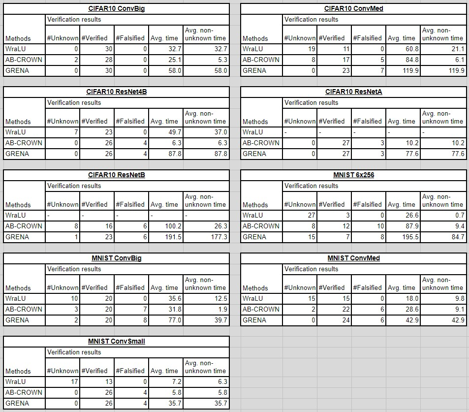
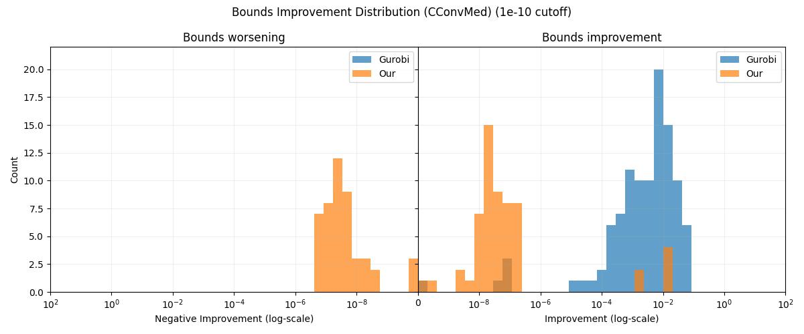
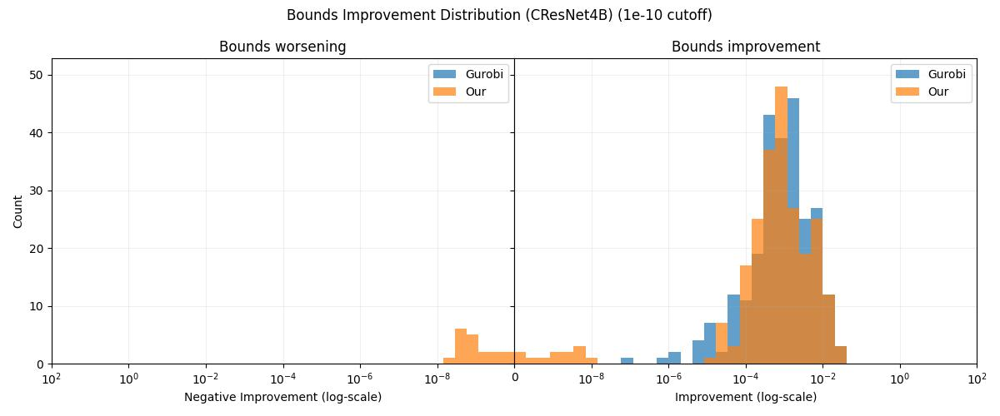
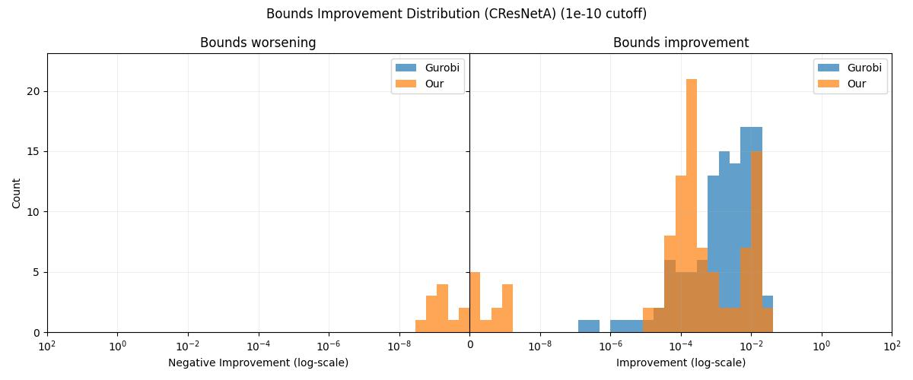
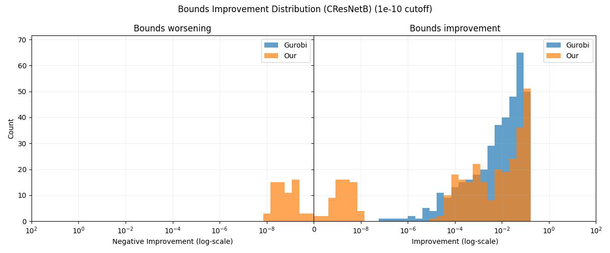
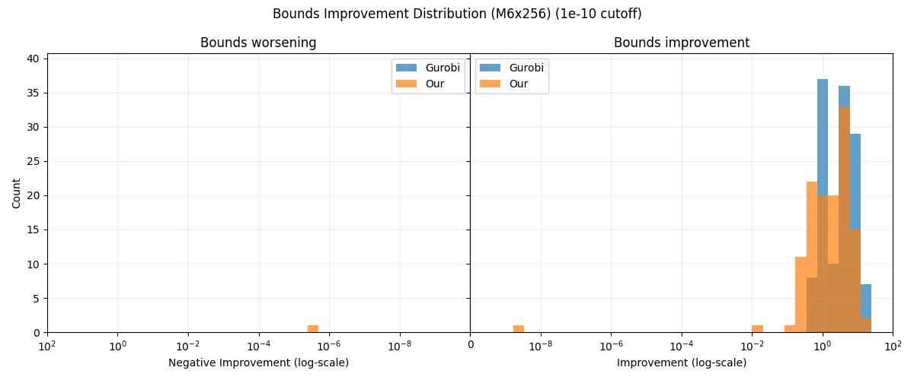
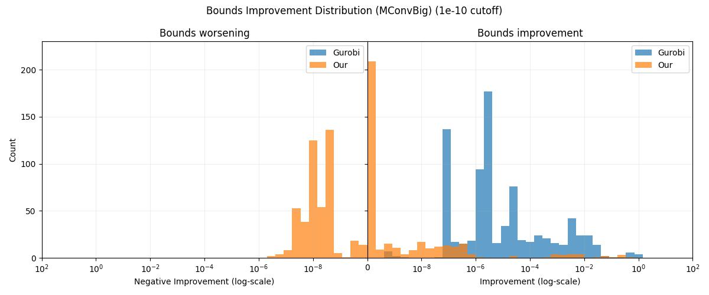
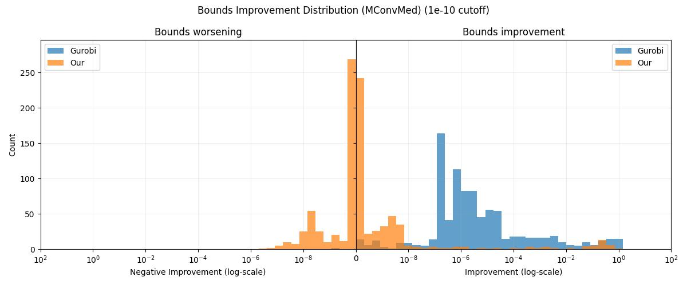
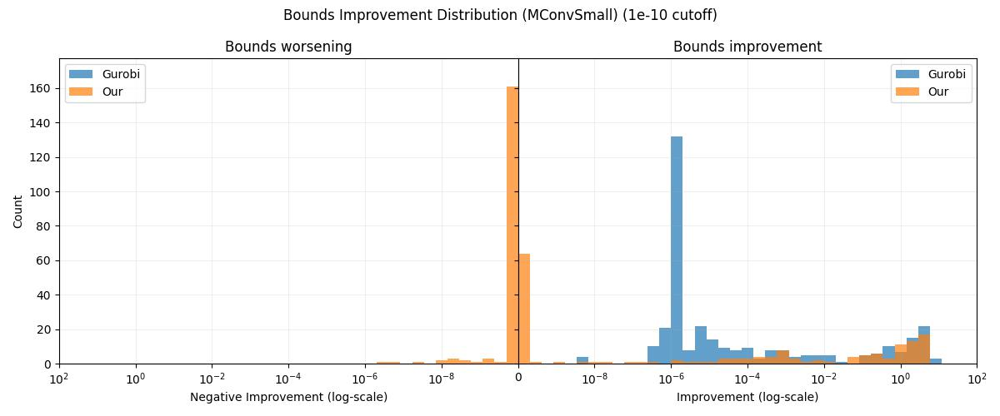

# GRENA-verifier

Our GRENA-verifier system builds on top of the [ETH Robustness Analyzer for Neural Networks (ERAN)](https://github.com/eth-sri/eran) system.

We use a tailored LP solver which is implemented in the `tf_verify/ml_bound_solver` directory.

We also utilized [WraLU: ReLU Hull Approximation](https://github.com/UQ-Trust-Lab/WraLU) to compute convex hull approximations of k-ReLU groups, instead of ELINA's `fkrelu` function as used in ERAN. Their implementations are placed in the `tf_verify/wralu_functions` directory.

<br>

## Setting up via Docker (recommended)

For setting up our system, we recommend using our dockerized implementation at the [Grena-verifier-dockerised](https://github.com/Grena-verifier/Grena-verifier-dockerised) repo for an easy setup.

If you prefer not to use Docker, follow the steps below.

<br>

## Setting up Manually

### System Requirements

You'll need

-   NVIDIA GPU(s)
-   Gurobi license _(i.e., the `gurobi.lic` file)_

As well as these libaries:

-   GNU C Compiler (GCC)
-   Python 3.8
-   CUDA Toolkit
-   CMake (≥3.17.1)

<br>

### Installation Steps

1.  Clone and initialise the ELINA submodule

    ```bash
    git clone https://github.com/Grena-verifier/Grena-verifier
    cd Grena-verifier
    git submodule update --init --recursive
    ```

1.  Install the required libraries and ELINA by running `install.sh` with root privileges:

    ```bash
    sudo bash install.sh
    ```

1.  Install the Python requirements:

    ```bash
    pip install --upgrade pip
    pip install -r requirements.txt
    ```

<br>

## Usage

The `tf_verify/Grena_runone_image.py` script provides a command-line interface for our verification system. Its key parameters are:

| Parameter    | Description                                                                                                              | Values/Format                                    |
| ------------ | ------------------------------------------------------------------------------------------------------------------------ | ------------------------------------------------ |
| `dataset`    | Dataset for verification<br> _(**Note:** `mnist` & `cifar10` use our 1000-row datasets)_                                 | `mnist`, `cifar10`, `acasxu`, `fashion`          |
| `netname`    | Network file path                                                                                                        | Supports: `.pb`, `.pyt`, `.tf`, `.meta`, `.onnx` |
| `output_dir` | Output directory path                                                                                                    | -                                                |
| `epsilon`    | L∞ perturbation value                                                                                                    | Float                                            |
| `imgid`      | Single image ID to execute verification on.<br>_(if not specified, runs on entire dataset.)_                             | Integer                                          |
| `use_wralu`  | WraLU solver type<br>_(if not specified, uses the ELINA's `fkrelu` solver)_                                              | `sci`, `sciplus`, `sciall`                       |
| `GRENA`      | Enable/Disable the GRENA refinement process                                                                              | Boolean<br>_(default: False)_                    |
| `timeout_AR` | Timeout in seconds for abstract refinement                                                                               | Float _(-1 disables timeout)_<br>_(default: -1)_ |
| `seed`       | Seed to initialize random number generators for reproducibility<br>_(if not specified, seed will not be explicitly set)_ | Integer                                          |

<br>

### Example Usage

A usage example from our verification experiment:

```bash
python Grena_runone_image.py  \
    --dataset "mnist"  \
    --netname "/app/Grena-verifier/models/mnist/convSmallRELU__Point.onnx"  \
    --output_dir "./results/MConvSmall/verify"  \
    --epsilon "0.11"  \
    --imgid "0"  \
    --use_wralu "sciplus"  \
    --GRENA  \
    --timeout_AR 600  \
    --seed 42  \
    \
    --domain refinepoly  \
    --sparse_n "50"  \
    --k "3"  \
    --s "1"  \
    --mean 0  \
    --std 1
```

A usage example from our bounds experiment:

```bash
python Grena_runone_image.py \
    --dataset "mnist" \
    --netname "/app/Grena-verifier/models/mnist/convSmallRELU__Point.onnx" \
    --output_dir "./results/MConvSmall/bounds" \
    --epsilon "0.11" \
    --imgid "75" \
    --use_wralu "sciplus" \
    --seed 42  \
    \
    --domain refinepoly \
    --sparse_n "50" \
    --k "3" \
    --s "1" \
    --mean 0 \
    --std 1
```

<br>

## Running the Experiments

### Models Tested

We tested 9 models across CIFAR-10 and MNIST datasets:

| Dataset  | Model Name | ONNX File Name                                   |
| -------- | ---------- | ------------------------------------------------ |
| CIFAR-10 | ConvBig    | convBigRELU\_\_DiffAI.onnx                       |
| CIFAR-10 | ConvMed    | convMedGRELU\_\_PGDK_w_0.0078.onnx               |
| CIFAR-10 | ResNet4B   | resnet_4b.onnx                                   |
| CIFAR-10 | ResNetA    | resnet_3b2_bn_mixup_adv_4.0_bs128_lr-1.onnx      |
| CIFAR-10 | ResNetB    | resnet_3b2_bn_mixup_ssadv_4.0_bs128_lr-1_v2.onnx |
| MNIST    | 6x256      | mnist-net_256x6.onnx                             |
| MNIST    | ConvBig    | convBigRELU\_\_DiffAI.onnx                       |
| MNIST    | ConvMed    | convMedGRELU\_\_Point.onnx                       |
| MNIST    | ConvSmall  | convSmallRELU\_\_Point.onnx                      |

Download all the models to the `/model` directory by running:

```bash
bash download_models.sh
```

<br>

### Experiment Scripts

Each model has two scripts in the `/experiment_scripts` directory:

-   `[C|M][MODEL_NAME]_verify.py` — Performs verification on 30 selected images per model
-   `[C|M][MODEL_NAME]_bounds.py` — Compares bounds tightening on 1 image using Gurobi vs our tailored solver

Scripts for CIFAR-10 models are prefixed with `C`, MNIST are prefixed with `M`.

To run any of the experiments, simply run the corresponding script with Python.

```bash
python CConvBig_verify.py
```

The experiment results will be saved to the `experiment_scripts/results/[MODEL_NAME]/[verify|bounds]/` directory. The main result files are:

-   `bounds/RESULT_bounds_improvement_plot.jpg`
-   `bounds/RESULT_solver_runtimes.csv`
-   `verify/RESULT_GRENA_verification.csv`

<br>

#### Experiment constant parameters

For all the experiments we've kept the below parameters constant to the values below:

| Variable    | Value       | Description                                   |
| ----------- | ----------- | --------------------------------------------- |
| `sparse_n`  | `50`        | ERAN's number of variables to group by k-ReLU |
| `k`         | `3`         | ERAN's refine group size                      |
| `s`         | `1`         | ERAN's refine group sparsity parameter        |
| `use_wralu` | `"sciplus"` | WraLU solver type                             |

<br>

## Experimental Results

We conducted 2 sets of experiments:

-   **Verification** — Perform verification on 30 selected images per model
-   **Bounds** — Compare bounds tightening on 1 image using Gurobi vs our tailored solver

<br>

### Verification Experiment



<br>

### Bounds Experiment

Below are symmetric log-scale histogram plots of the improvements from the bound tightening experiment.









