# GRENA-verifier

Our GRENA-verifier system builds on top of the [ETH Robustness Analyzer for Neural Networks (ERAN)](https://github.com/eth-sri/eran) system.

We use a tailored LP solver which is implemented in the `tf_verify/ml_bound_solver` directory.

We also utilized [WraLU: ReLU Hull Approximation](https://github.com/UQ-Trust-Lab/WraLU) to compute convex hull approximations of k-ReLU groups, instead of ELINA's `fkrelu` function as used in ERAN. Their implementations are placed in the `tf_verify/wralu_functions` directory.

<br>

# Setting up via Docker (recommended)

For setting up our system, we recommend using our dockerized implementation at the [Grena-verifier-dockerised](https://github.com/Grena-verifier/Grena-verifier-dockerised) repo for an easy setup.

If you prefer not to use Docker, follow the steps below.

<br>

# Setting up Manually

## System Requirements

You'll need

-   NVIDIA GPU(s)
-   Gurobi license _(i.e., the `gurobi.lic` file)_

As well as these libaries:

-   GNU C Compiler (GCC)
-   Python 3.8
-   CUDA Toolkit
-   CMake (≥3.17.1)

<br>

## Installation Steps

1.  Clone and initialise the ELINA submodule

    ```bash
    git clone https://github.com/Grena-verifier/Grena-verifier
    cd Grena-verifier
    git submodule update --init --recursive
    ```

1.  Install the required libraries and ELINA by running `install.sh` with root privileges:

    ```bash
    sudo bash install.sh
    ```

1.  Install the Python requirements:

    ```bash
    pip install --upgrade pip
    pip install -r requirements.txt
    ```

<br>

# Usage

The `tf_verify/Grena_runone_image.py` script provides a command-line interface for our verification system. Its key parameters are:

| Parameter    | Description                                                                                                                                                                     | Values/Format                                     |
| ------------ | ------------------------------------------------------------------------------------------------------------------------------------------------------------------------------- | ------------------------------------------------- |
| `dataset`    | Dataset to execute the experiment on<br> _(**NOTE:** `mnist` & `cifar10` use our 1000-row datasets)_                                                                            | `mnist`, `cifar10`                                |
| `netname`    | Network file path                                                                                                                                                               | String<br>_(supports only `.onnx` files)_         |
| `output_dir` | Directory path to save experiment outputs                                                                                                                                       | String<br>_(default: `"./results"`)_              |
| `epsilon`    | L∞ perturbation value                                                                                                                                                           | Float                                             |
| `imgid`      | A single image ID to execute the experiment on                                                                                                                                  | Integer                                           |
| `use_wralu`  | WraLU's convex hull approximation method _(see footnote [1] below)_<br>_(if not specified, uses the ELINA's `fkrelu` solver)_                                                   | `sci`, `sciplus`, `sciall`                        |
| `GRENA`      | Sets system to do abstract refinement based verification experiment<br>_(if not specified, bounds comparison experiment will be done instead)_                                  | –<br>_(doesn't take values)_                      |
| `timeout_AR` | Timeout in seconds for abstract refinement based verification experiment<br>_(if not specified, disables timeout)_<br>For our verification experiments, we set timeout to `600` | Float<br>_(default: `-1`, i.e. timeout disabled)_ |
| `seed`       | Seed for random number generators<br>Given the same seed, the same result will be produced<br>_(if not specified, seed will not be explicitly set)_                             | Integer                                           |

> _**[1]:**_ \
> _`sci`, `sciplus`, `sciall` are the [3 convex hull approximation methods](https://github.com/UQ-Trust-Lab/WraLU/blob/main/kact/krelu/sci.py) provided by the [WraLU: ReLU Hull Approximation](https://github.com/UQ-Trust-Lab/WraLU) system, with `sci` being the fastest & least accurate, and `sciall` being the slowest & most accurate._ \
> _For our experiments, we used `sciplus` for balance of performance & speed._

<br>

## Example Usage

A usage example from our verification experiment:

```bash
cd tf_verify
python Grena_runone_image.py  \
    --dataset "mnist"  \
    --netname "/app/Grena-verifier/models/mnist/convSmallRELU__Point.onnx"  \
    --output_dir "./results/MConvSmall/verify"  \
    --epsilon "0.11"  \
    --imgid "0"  \
    --use_wralu "sciplus"  \
    --GRENA  \
    --timeout_AR 600  \
    --seed 42  \
    \
    --domain refinepoly  \
    --sparse_n "50"  \
    --k "3"  \
    --s "1"  \
    --mean 0  \
    --std 1
```

A usage example from our bounds experiment:

```bash
cd tf_verify
python Grena_runone_image.py \
    --dataset "mnist" \
    --netname "/app/Grena-verifier/models/mnist/convSmallRELU__Point.onnx" \
    --output_dir "./results/MConvSmall/bounds" \
    --epsilon "0.11" \
    --imgid "75" \
    --use_wralu "sciplus" \
    --seed 42  \
    \
    --domain refinepoly \
    --sparse_n "50" \
    --k "3" \
    --s "1" \
    --mean 0 \
    --std 1
```

<br>

# Running the Experiments

## Models Tested

We tested 9 models across CIFAR-10 and MNIST datasets:

| Dataset  | Model Name | ONNX File Name                                   |
| -------- | ---------- | ------------------------------------------------ |
| CIFAR-10 | ConvBig    | convBigRELU\_\_DiffAI.onnx                       |
| CIFAR-10 | ConvMed    | convMedGRELU\_\_PGDK_w_0.0078.onnx               |
| CIFAR-10 | ResNet4B   | resnet_4b.onnx                                   |
| CIFAR-10 | ResNetA    | resnet_3b2_bn_mixup_adv_4.0_bs128_lr-1.onnx      |
| CIFAR-10 | ResNetB    | resnet_3b2_bn_mixup_ssadv_4.0_bs128_lr-1_v2.onnx |
| MNIST    | 6x256      | mnist-net_256x6.onnx                             |
| MNIST    | ConvBig    | convBigRELU\_\_DiffAI.onnx                       |
| MNIST    | ConvMed    | convMedGRELU\_\_Point.onnx                       |
| MNIST    | ConvSmall  | convSmallRELU\_\_Point.onnx                      |

Download all the models to the `/model` directory by running:

```bash
bash download_models.sh
```

<br>

## Experiment Scripts

Each model has two scripts in the `/experiment_scripts` directory:

-   `[C|M][MODEL_NAME]_verify.py` — Perform abstract refinement based verification on 30 selected images per model
-   `[C|M][MODEL_NAME]_bounds.py` — Compare bounds tightening on 1 image using Gurobi vs our tailored solver

Scripts for CIFAR-10 models are prefixed with `C`, MNIST are prefixed with `M`.

To run any of the experiments, simply run the corresponding script with Python.

```bash
cd experiment_scripts
python CConvBig_verify.py   # for CIFAR10 ConvBig verification exp.
```

> :bulb: _**NOTE:** The scripts will save all console logs to `terminal.log` within the corresponding model's results directory instead of printing to the terminal._

The experiment results will be saved to the `experiment_scripts/results/[MODEL_NAME]/[verify|bounds]/` directory:

```
# For example:
.
├── tf_verify/
├── experiment_scripts/
│   └── results/
|       ├── M6x256
│       │   ├── bounds/  <---
│       │   └── verify/  <---
|       └── MConvSmall
│           ├── bounds/  <---
│           └── verify/  <---
├── README.md
├── download_models.sh
├── install_libraries.sh
├── install.sh
└── requirements.txt
```

The main result files are:

-   `bounds/RESULT_bounds_improvement_plot.jpg`
-   `bounds/RESULT_solver_runtimes.csv`
-   `verify/RESULT_GRENA_verification.csv`

<br>

### Experiment constant parameters

For all the experiments we've kept the below parameters constant to the values below:

| Variable    | Value       | Description                                   |
| ----------- | ----------- | --------------------------------------------- |
| `sparse_n`  | `50`        | ERAN's number of variables to group by k-ReLU |
| `k`         | `3`         | ERAN's refine group size                      |
| `s`         | `1`         | ERAN's refine group sparsity parameter        |
| `use_wralu` | `"sciplus"` | WraLU solver type                             |

<br>

# Experimental Results (Unseeded)

Theres are our results for our abstract refinement based verification and bounds comparision experiments.

As our tailored LP solver has some inherent randomness, you might not get the same results as shown below.

Thus for reproducibility, our scripts in the `/experiment_scripts` dir has the `--seed` flag set to `42`, and provided the results for those in the [**Experimental Results (Seed 42)**](#experimental-results-seed-42) section below. However, do note that the seeding process slows down the bounds solving process, and you can expect an increase in runtime of up to 50%.

## Verification Experiment (Unseeded)

Below are the abstract refinement based verification experiment results without any seeding.

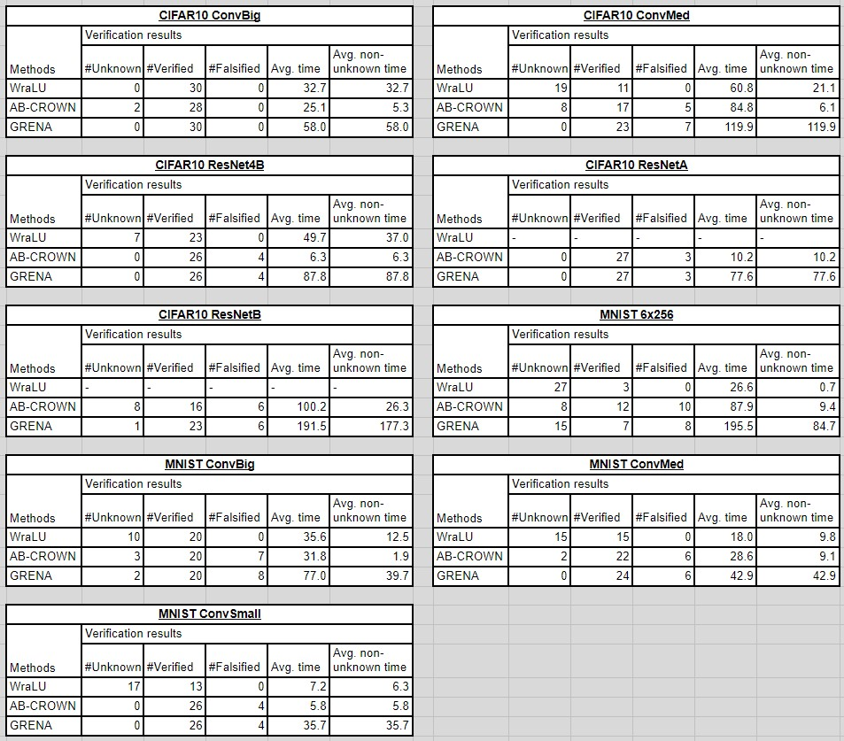

<br>

## Bounds Experiment (Unseeded)

Below are the log-scale histogram plots of the bound improvements from the bound comparison experiment without any seeding.

"Improvement" is defined as the difference between the original upper and lower bounds, minus the difference between the Gurobi/tailored-solved bounds:

```
improvement = (old_upper_bounds - old_lower_bounds) - (new_upper_bounds - new_lower_bounds)
```

The graphs shows the spread of the bounds improvement for both Gurobi (in blue) and our tailored solver (in orange). The height of the bars represents the number of neurons with improvement at the magnitude. Towards the right of the graph are exponentially bigger improvements.

To interpret the results, if the orange bars significantly overlaps with the blue bars, it means our tailored solver achieved improvements comparable to that from Gurobi. If the orange bars are shifted towards the left of the blue bars, it means our tailored solver has significantly smaller improvements compared to Gurobi's.

| 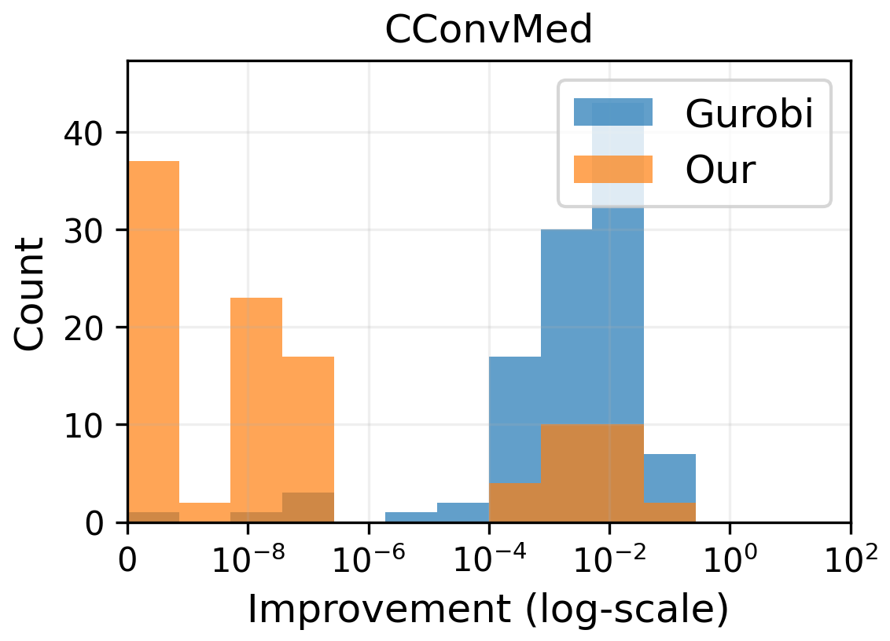 |    |
| --------------------------------------------------------------------------- | ------------------------------------------------------------------------------- |
|  |      |
| 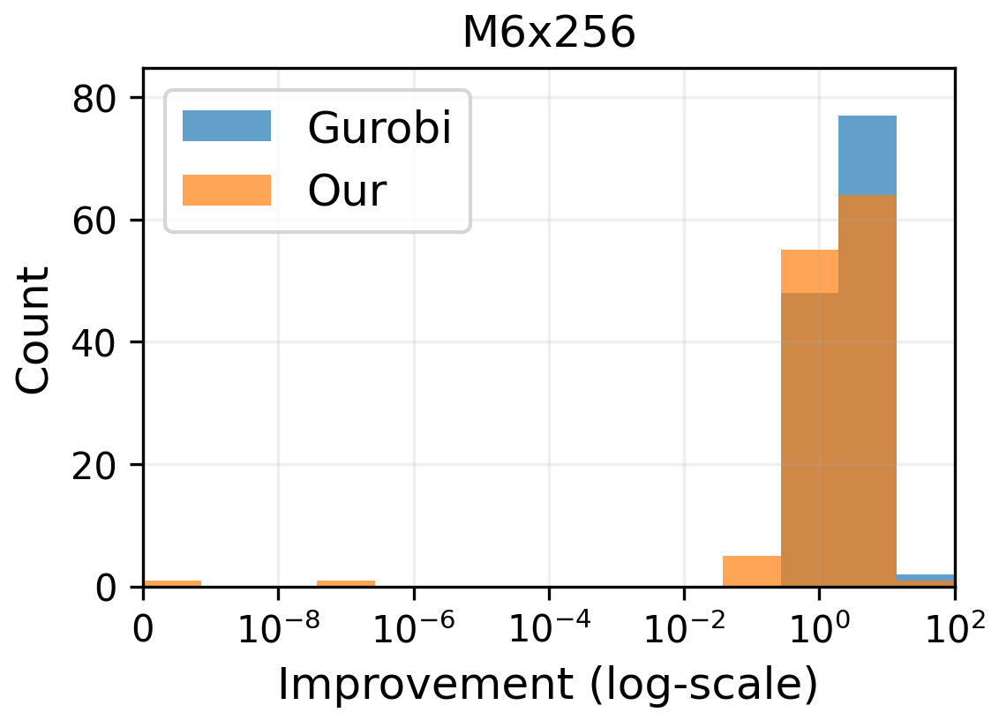     | 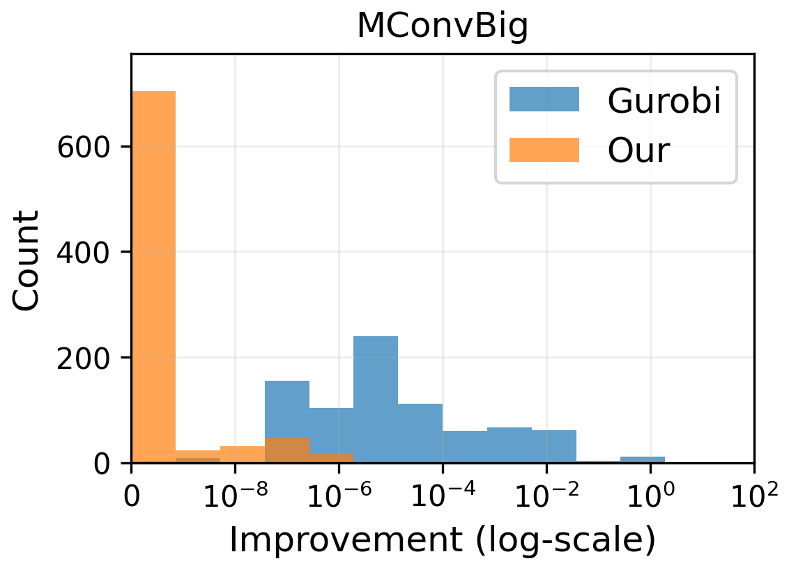     |
| 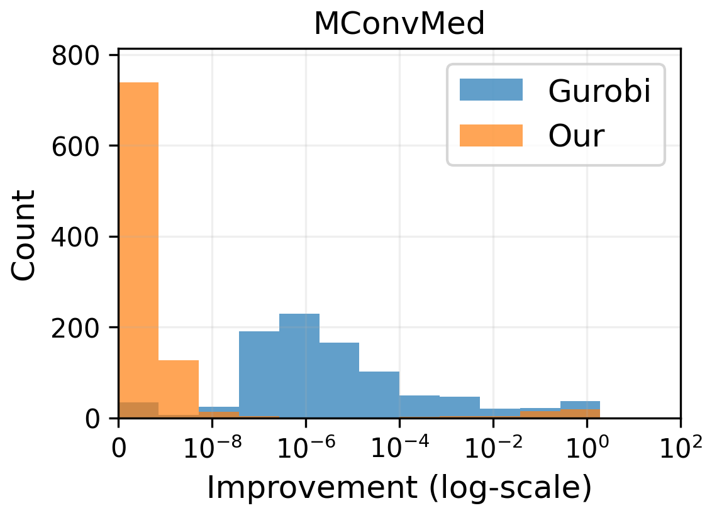 |  |

| Model      | Gurobi runtime (s) | Tailored solver runtime (s) |
| ---------- | ------------------ | --------------------------- |
| CConvMed   | 18338.4            | 23.9                        |
| CResNet4B  | 74185.5            | 25.6                        |
| CResNetA   | 51283.1            | 15.3                        |
| CResNetB   | 56431.4            | 37.7                        |
| M6x256     | 478.1              | 28.9                        |
| MConvBig   | 69915.4            | 211.9                       |
| MConvMed   | 12858.4            | 21.2                        |
| MConvSmall | 536.3              | 14.5                        |

<br>

# Experimental Results (Seed 42)

Below are the results with the `--seed` flag set to `42` to be reproducible.

## Verification Experiment (Seed 42)

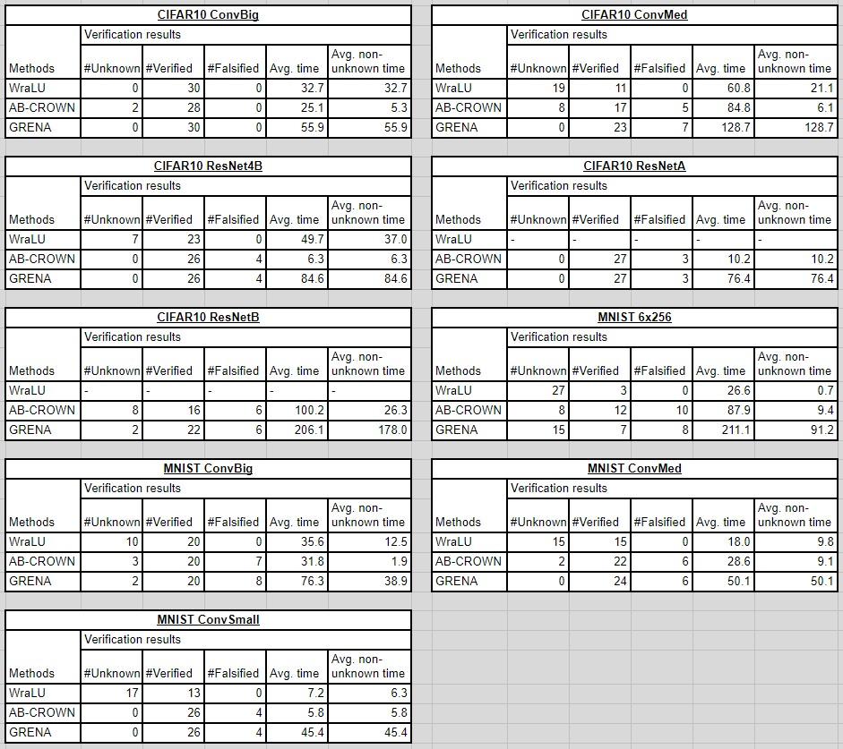

> :bulb: \_**NOTE:** Due to the increased runtime from seeding, 1 of the "verified" images for the seeded CIFAR10 ResNetB times out instead and becoming "unknown".

<br>

## Bounds Experiment (Seed 42)

| 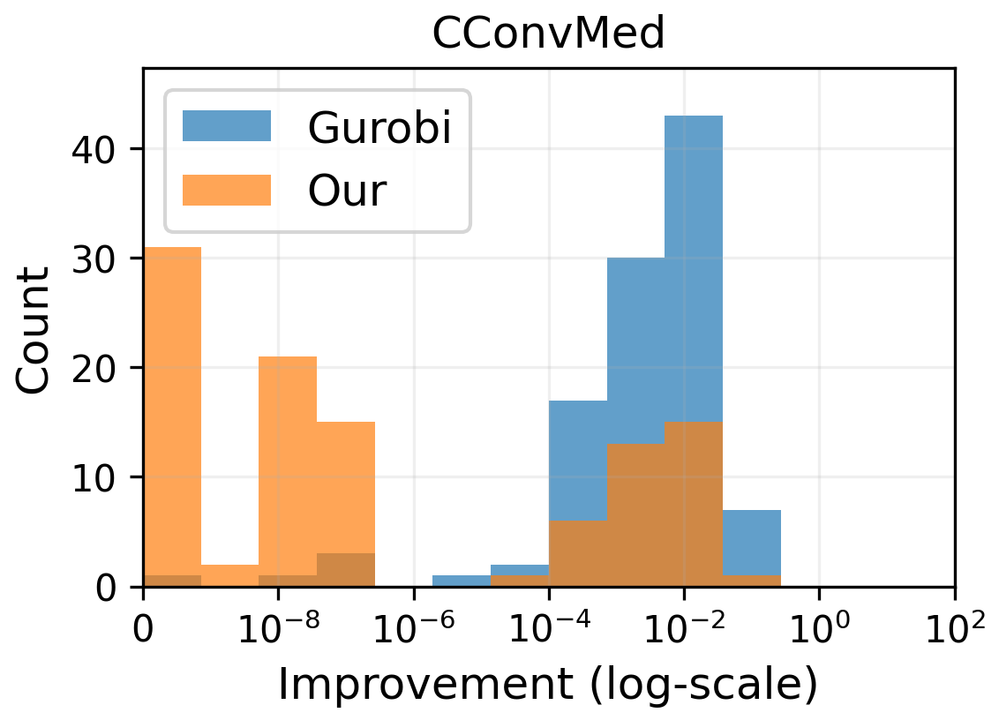 | 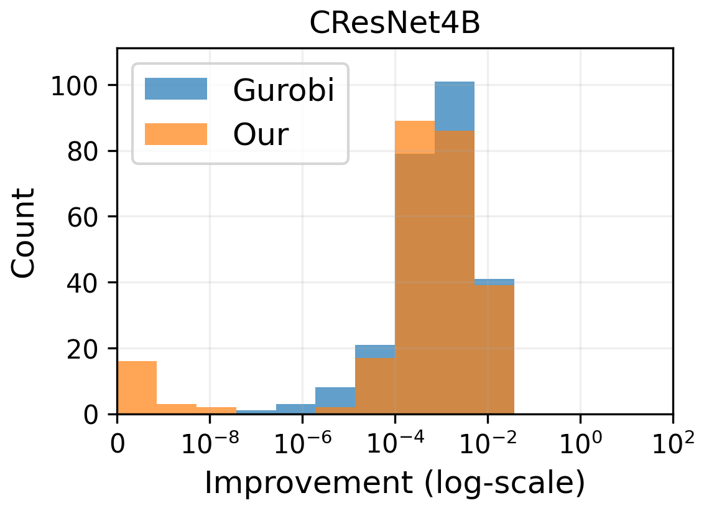   |
| ------------------------------------------------------------------------- | ----------------------------------------------------------------------------- |
| 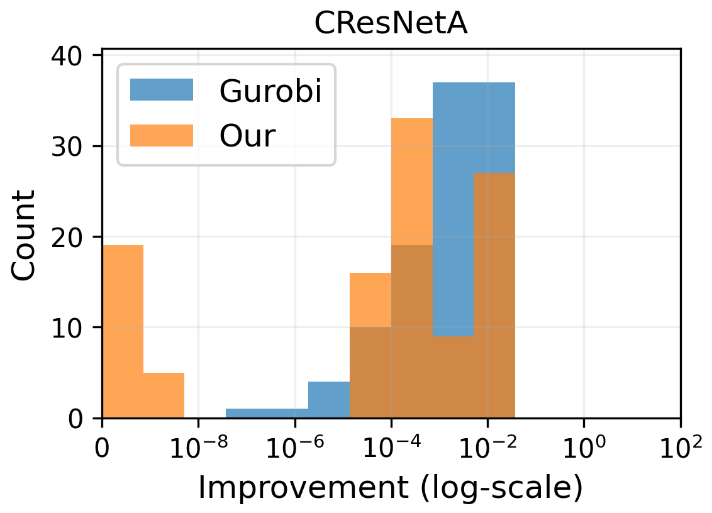 | 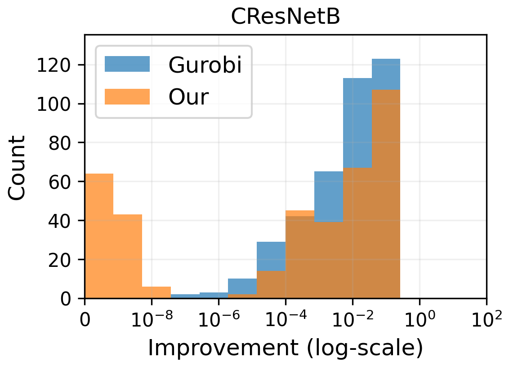     |
| 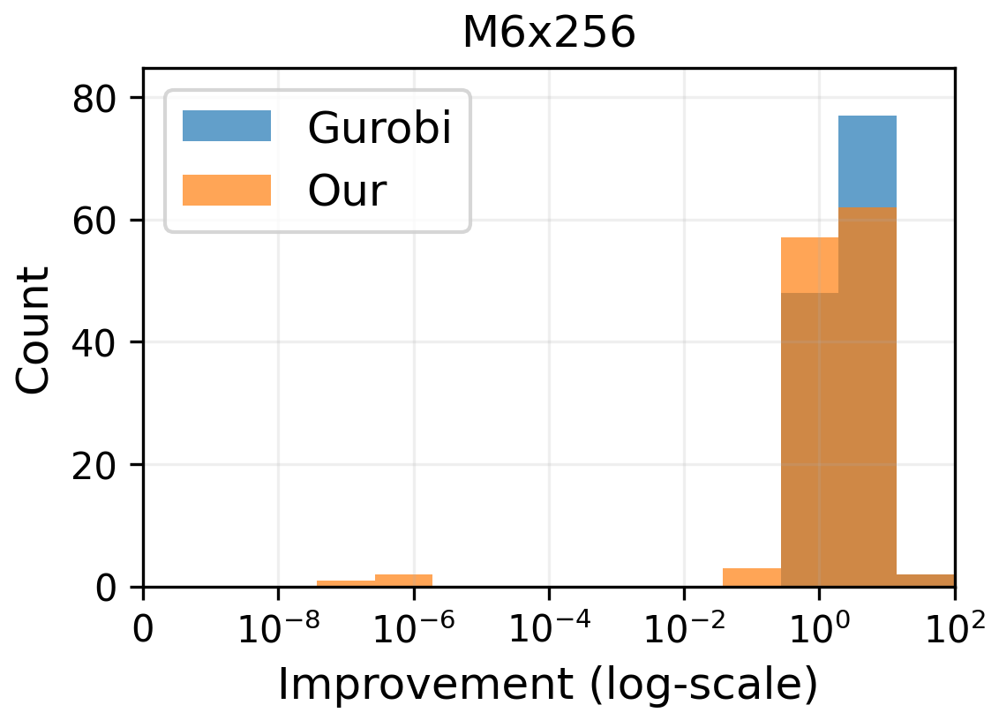     | 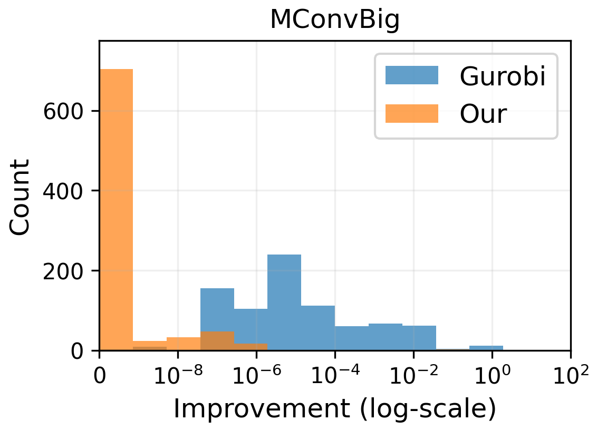     |
| 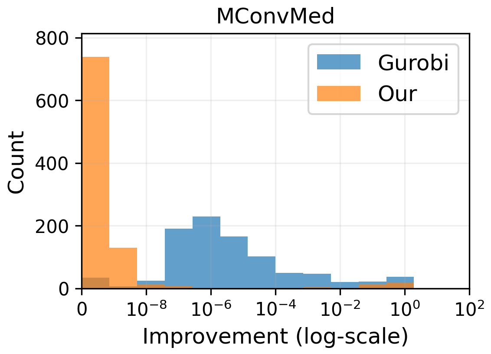 | 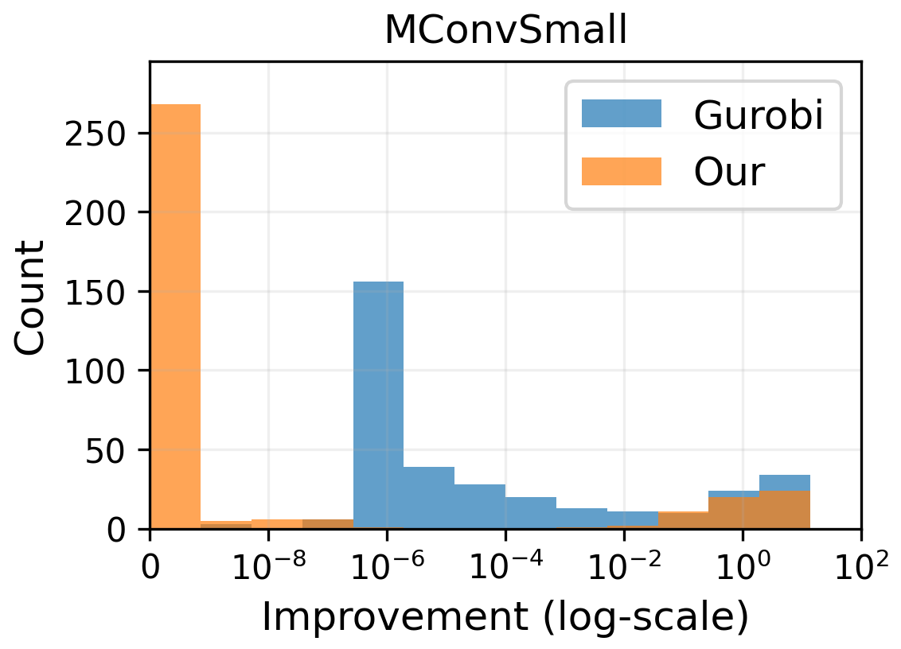 |

| Model      | Gurobi runtime (s) | Tailored solver runtime (s) |
| ---------- | ------------------ | --------------------------- |
| CConvMed   | 18338.4            | 36.6                        |
| CResNet4B  | 74185.5            | 44.0                        |
| CResNetA   | 51283.1            | 26.0                        |
| CResNetB   | 56431.4            | 53.3                        |
| M6x256     | 478.1              | 40.4                        |
| MConvBig   | 69915.4            | 302.6                       |
| MConvMed   | 12858.4            | 27.6                        |
| MConvSmall | 536.3              | 25.9                        |
